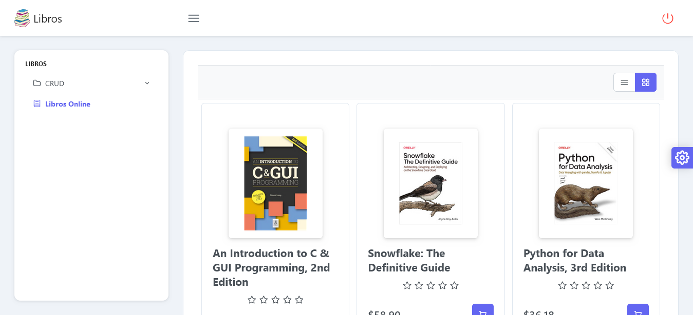

# Prueba de desarrollo

## vista previa del aplicativo



## Para ejecutar el backend debe segir los siguientes pasos
1. clone este repositorio.
2. cree una base de datos mysql de nombre = librerialibros 
3. configure su archivo .env

```sh
DB_CONNECTION=mysql
DB_HOST=127.0.0.1
DB_PORT=3306
DB_DATABASE=librerialibros 
DB_USERNAME=root
DB_PASSWORD=
```

```sh
composer installl
```

### Compile and Hot-Reload for Development

```sh
php artisan migrate
```

### Compilar o ejecutar el servidor

```sh
php artisan serve
```

### Lo siguientes pasos seran ir al proyecto del frontend y segir los pasos del readme

https://github.com/JulianLlanten8/frontendLibros
